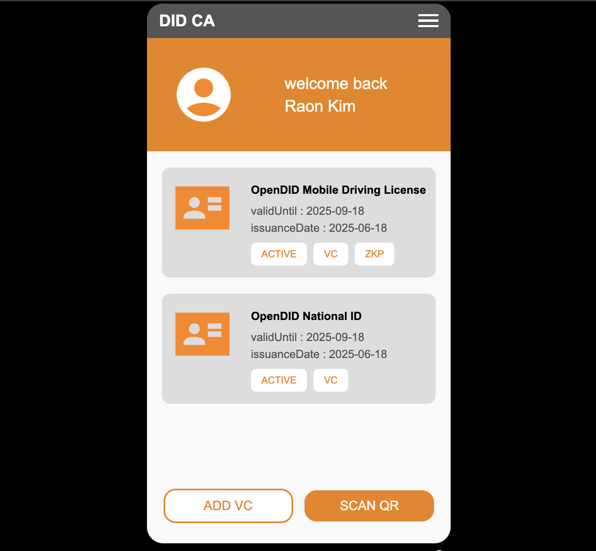
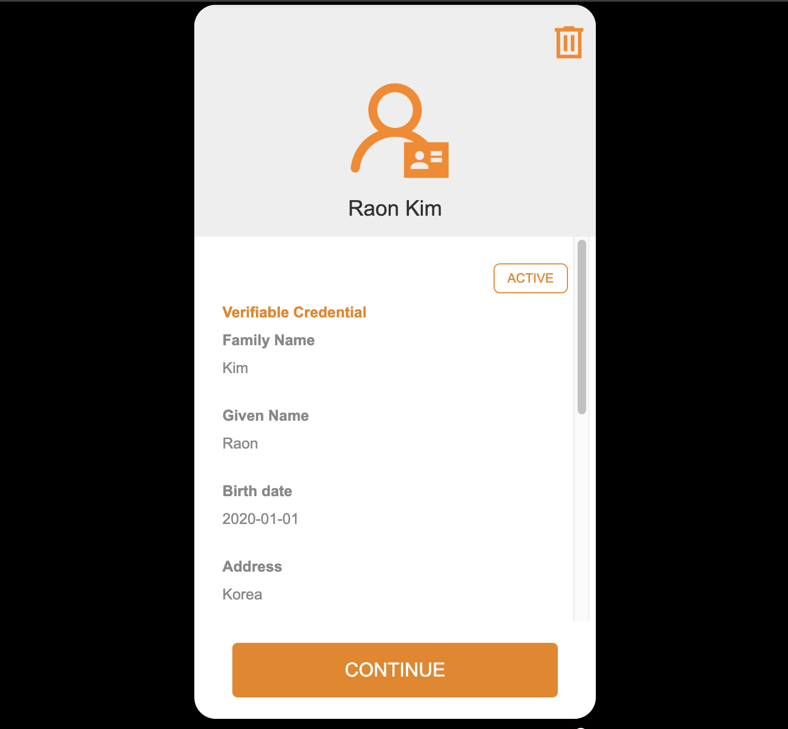
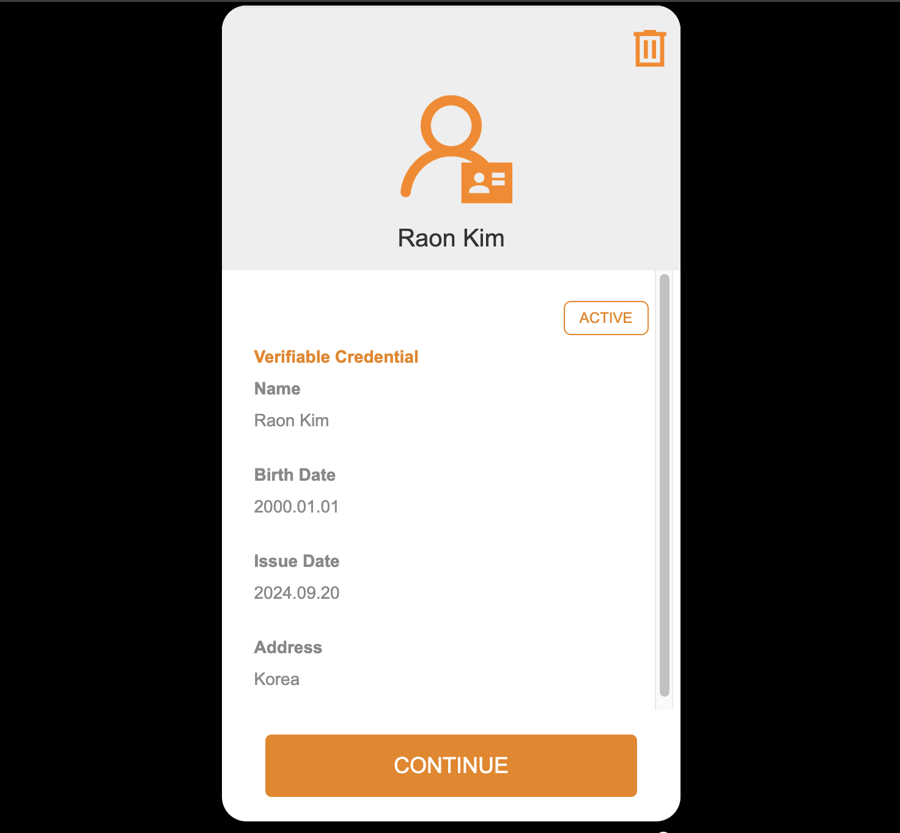

# Demo App Guide (V2.0.0.0)

## step1

- The 'Open DID Wallet' screen appears and guides the user through the registration process step by step.  
- Confirm that Step 1 is in progress and click the `NEXT` button.  
- Step 1 involves entering user information and setting a lock type for the wallet.  

## user_info

- The 'User Information' screen appears, and the user is prompted to enter their information.  
- Required fields are `First Name` and `Last Name`, which are used for:  
  - Generating PII with salt.  
  - Displaying user info on issued VCs in the app.  

## lock_popup

- Wallet lock type setting screen. Not supported in this demo.  

## step2

- Confirm that Step 2 is in progress and click the `NEXT` button.  
- Step 2 involves generating a DID Document and registering an authentication method.  

## pin_registration

- Register a 6-digit PIN as an authentication method for signing.  
- After registration, a DID Document is created for the user.  

## finger_popup

- A popup prompts the user to choose whether to register a fingerprint for signing.  
- Only PIN registration is supported in this demo.  

## step3

- Confirm that Step 3 is in progress and click the `NEXT` button.  
- Step 3 involves signing and registering the DID Document.  

## pin_authentication

- Enter the 6-digit PIN to sign and register the DID Document.  

## main

- Initially, no VC is issued, so the message `"No certificate has been issued."` is shown.  

- Once VCs are issued, they are displayed in a list.
- This demo includes mDL with ZKP Credential, allowing confirmation of its inclusion.
- There are three possible VC statuses: ACTIVE, INACTIVE, and REVOKED, but this demo only displays the ACTIVE status.

- Two buttons are available at the bottom:
  - ADD VC: Issues VC through User Initiated method.  
  - SCAN QR: Scans a QR code for Issuer Initiated VC issuance or VP submission.  

- Two types of VCs are available:
  - National ID: User Initiated  
  - mDL (Mobile Driving License): Issuer Initiated  

## add_vc

- To issue a VC, select `National ID Plan` from the list of available VCs.  

## scan_qr_vc

- Scan the QR code for VC issuance.  
- This demo shows the scan screen without actual scanning.  

## issue_profile

- Confirm information such as issuer, VC name, and issue date.  

## vc_info

- Enter the following information to proceed with issuance:
  - Birthdate  
  - Address  
  - License Number  
  - Issue Date  

## vc_authentication

- Enter the previously set PIN.  

## issue_result

- VC issuance result is shown to the user.

## select_qr

- Select a QR code for VP or ZKP Proof submission.  
- This demo substitutes actual scanning with a selection screen.  

## scan_qr_vp

- Scan a QR code for VP submission.  
- This demo shows the scan screen without actual scanning.  

## verify_profile

- Confirm the claims to be submitted.  

## vp_authentication

- Enter the previously set PIN.  

## verify_result

- Confirmation message for completed submission.  

## scan_qr_proof

- Scan a QR code for ZKP Proof submission.  
- This demo shows the scan screen without actual scanning.  

## proof_request_profile

- Confirm ZKP attribute information to be submitted.  

## zkp_submission_select

- Confirm the ZKP attribute information.  
- Option to hide region, name, and citizenship.  
- Hidden info will not be disclosed upon submission.  

## detail_mdl

- View detailed information of the issued mDL.  
- In this demo, ZKP Credential is included in the issued mDL.  

## detail_nid

- View detailed information of the issued National ID.  

## settings

- Shows TAS and Verifier URLs. Arbitrary values are used in this demo.  
- After creating the user's DID Document, the DID can be checked here.  
