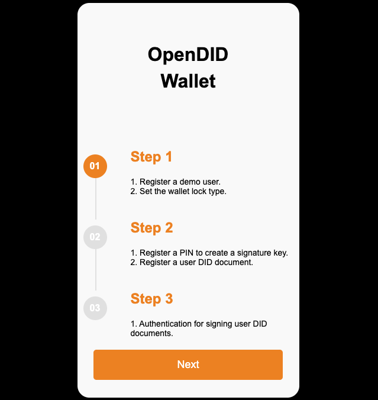
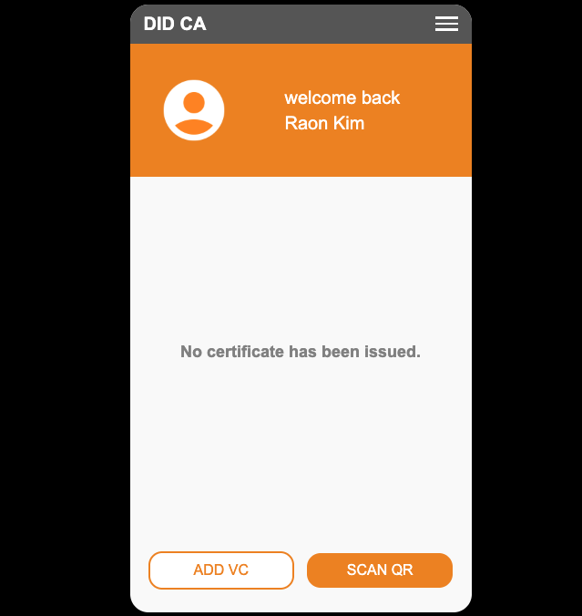

# Demo App Guide (V2.0.0.0)

The demo app proceeds in the following order: **User Registration → VC Issuance → VP Submission**.  
When the app is launched for the first time, it creates the user’s **Wallet**.

---

## User Registration
  
User registration consists of **Step 1 to Step 3**.

### Step 1: Enter User Information
- Enter the user's **First Name** and **Last Name**.
- There is a screen to set the **Wallet Lock Type**, but this demo **does not support it**.
- If a wallet lock type is set, PIN authentication will be required to access the wallet.

### Step 2: Create DID Document & Register Authentication Method
- The user's **DID Document** is created.
- For signing, you can choose between **PIN and Fingerprint**, but this demo **only supports PIN registration**.
- After registering the PIN, the user’s DID Document is generated.

### Step 3: Sign to Register DID Document
- Enter the **PIN set during registration** to proceed with the signature.
- Once the signature is complete, the **DID Document registration is finalized**, and the app navigates to the main screen.

User registration is completed through the procedures from **step 1 to step 3**.

---

## Main Screen
  
- After user registration, if no VC has been issued,  
  the message `"No certificate has been issued."` will be displayed.
- Once VCs are issued, a **list of VCs** will appear on the screen.
- At the bottom, two buttons are available:
  - **ADD VC**: Issues a VC via the **User-Initiated** method.
  - **SCAN QR**: Scans a QR code for **VC issuance or VP submission** via the **Issuer-Initiated** method.

### Available VCs for Issuance
- **National ID**: User-Initiated method (ADD VC)
- **mDL (Mobile Driving License)**: Issuer-Initiated method (SCAN QR)

---

## VC Issuance

### ADD VC Method (User-Initiated)
1. Select ADD VC and choose `National ID Plan` from the list of available VCs.
2. The app displays the **issuer, VC name, and issue date** for user confirmation.
3. The user enters the following **issuance information**:
   - Birthdate  
   - Address  
   - License Number  
   - Issue Date  
4. Enter the **PIN set during registration** to complete the VC issuance.

### SCAN QR Method (Issuer-Initiated)
1. Select SCAN QR and scan the **VC issuance QR code**.
2. Based on the QR information, the app shows **issuer, VC name, and issue date** for user confirmation.
3. Enter the **PIN set during registration** to complete the VC issuance.
4. The issued VC includes a **ZKP Credential**.

---

## VP Submission

- If `mDL` has been issued, the **"OpenDID Mobile Driving License"** item will be visible on the main screen.
- If `National ID` has been issued, the **"OpenDID National ID"** item will be visible on the main screen.
- Then, use SCAN QR to scan either the **VP submission QR code for mDL** or the **ZKP Proof submission QR code for National ID**.
- Based on the QR information, the app displays the submission request details for confirmation.
- Enter the **PIN set during registration** to complete the VP submission.
- For **ZKP Proof submission**, since the user's signature is not required, **the submission is completed without PIN entry**.
