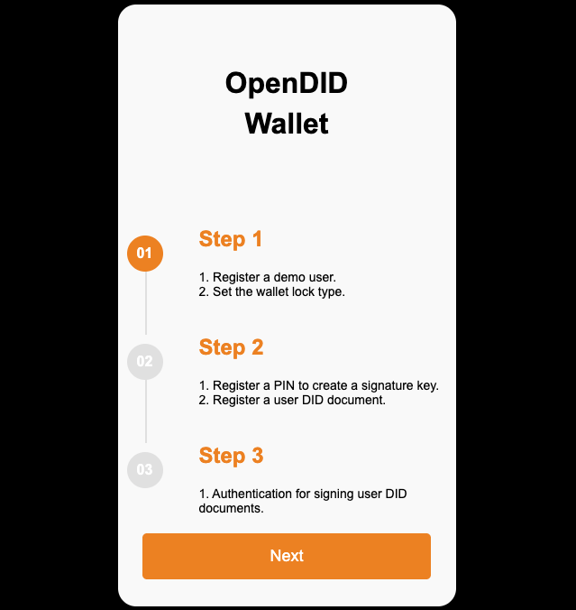
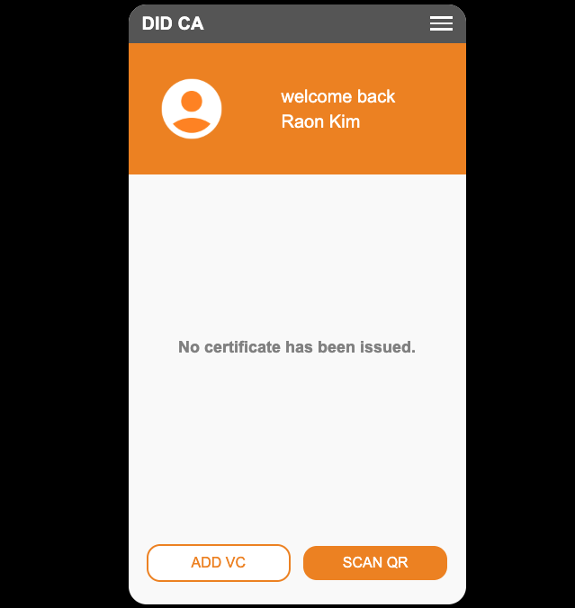

# Demo App 가이드 (V2.0.0.0)

데모 앱은 **사용자 등록 → VC 발급 → VP 제출** 순서대로 진행됩니다.  
최초 앱 실행 시 사용자의 **Wallet** 을 생성합니다.

---

## 사용자 등록

사용자 등록은 **step1에서 step3의** 절차로 구성됩니다.

### Step 1: 사용자 정보 입력
- 사용자의 **First Name**과 **Last Name**을 입력합니다.
- **지갑의 잠금 타입** 설정 화면이 있으나, 본 데모에서는 **지원하지 않습니다**.
- 지갑 잠금 타입을 설정하면, 지갑 접근 시 사용자의 PIN 인증을 거치게 됩니다.

### Step 2: DID Document 생성 및 인증 수단 등록
- 사용자의 **DID Document**를 생성합니다.
- 서명을 위한 인증 수단으로 **PIN과 지문** 중 선택할 수 있으나, 본 데모에서는 **PIN 등록만 지원**합니다.
- PIN 등록 후 사용자의 DID Document를 생성합니다.

### Step 3: DID Document 등록 서명
- 사용자가 등록한 **PIN을 입력**하여 서명을 진행합니다.
- 서명 완료 시 **DID Document 등록이 완료**되며, 메인 화면으로 진입합니다.

**step1에서 step3의** 절차를 통하여 사용자 등록이 완료됩니다.

---

## 메인화면

- 최초 사용자 등록 후에는 발급받은 VC가 없기 때문에  
  `"No certificate has been issued."` 라는 문구가 표시됩니다.
- VC가 발급된 경우에는 **VC 목록**이 화면에 표시됩니다.
- 하단에는 다음 두 개의 버튼이 존재합니다:
  - **ADD VC**: 사용자 주도(User Initiated) 방식으로 VC를 발급합니다.
  - **SCAN QR**: 발급기관 주도(Issuer Initiated) 방식으로 **VC 발급 또는 VP 제출**을 위한 QR 코드를 스캔합니다.

### 발급 가능한 VC
- **National ID**: User Initiated 방식 (ADD VC)
- **mDL (Mobile Driving License)**: Issuer Initiated 방식 (SCAN QR)

---

## VC 발급

### ADD VC 방식 (User Initiated)
1. ADD VC 선택 후, **발급 가능한 VC 목록**에서 `National ID Plan` 선택
2. 발급기관, VC 이름, 발급일 등의 정보를 사용자에게 확인시켜줍니다.
3. 사용자가 다음의 **발급 정보**를 입력합니다:
   - Birthdate
   - Address
   - License Number
   - Issue Date
4. 사용자 등록 시 설정한 **PIN 입력 후 VC 발급 완료**합니다.

### SCAN QR 방식 (Issuer Initiated)
1. SCAN QR을 선택하여 **발급용 QR 코드**를 스캔합니다.
2. QR 정보 기반으로 **발급기관, VC 이름, 발급일** 등의 정보를 사용자에게 확인시켜줍니다.
3. 사용자 등록 시 설정한 **PIN 입력 후 VC 발급 완료**합니다.
4. 발급받은 VC는 **ZKP Credential**을 포함합니다. 

---

## VP 제출

- `mDL`이 발급되어 있으면 메인 화면에서 **"OpenDID Mobile Driving License"** 항목을 확인할 수 있습니다.
- `National ID`가 발급되어 있으면 메인 화면에서 **"OpenDID National ID"** 항목을 확인할 수 있습니다.
- 이후 SCAN QR을 통해 **mDL에 대한 VP 제출용 QR 코드** 또는 **National ID에 대한 ZKP Proof 제출용 QR 코드**를 선택 후 스캔합니다.
- QR 정보 기반으로 제출 요청 정보를 사용자에게 확인시켜줍니다.
- 사용자 등록 시 설정한 **PIN을 입력하여 VP 제출을 완료**합니다.
- **ZKP Proof 제출**은 사용자의 서명이 필요없기 때문에 PIN 입력을 하지않고 **ZKP Proof 제출을 완료**합니다.
